# TV-Shows

Basic TV show app, allows you to track your favorite shows, explore their details and episodes, 
created episodes or even comment on episode.

# App workflow
## LoginView

When entering app, first will be shown the Login view where you can insert your credentials, save them and login in the app. If bad credentals are entered the user will retrive assosiated popUp.

 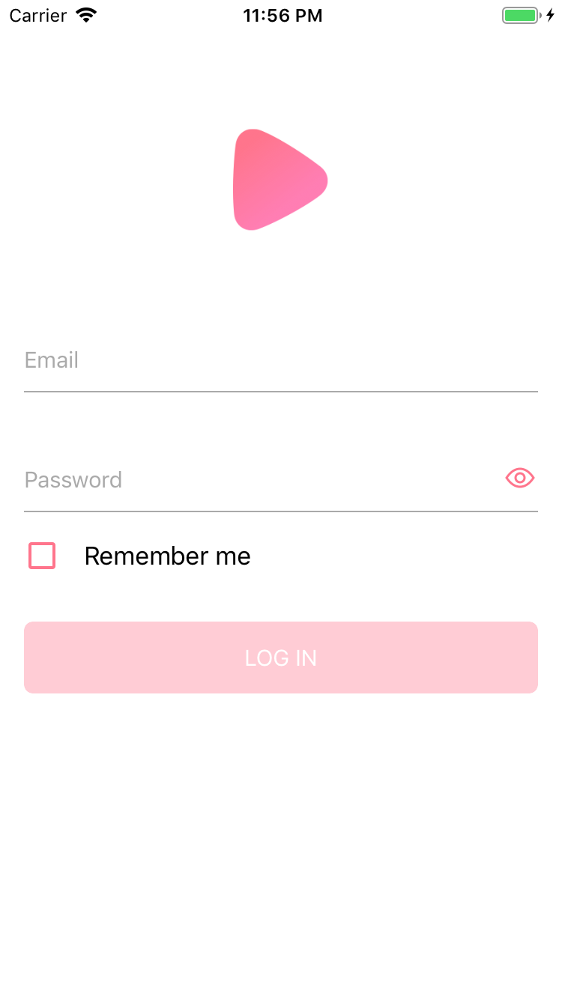  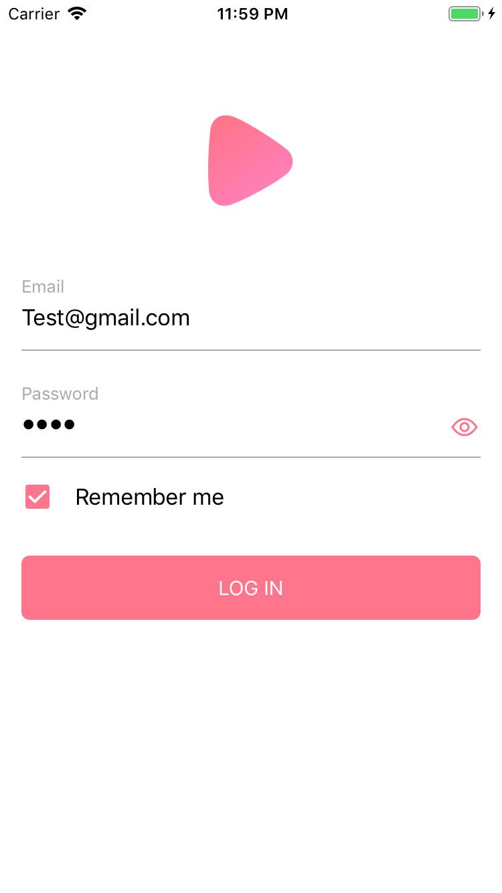 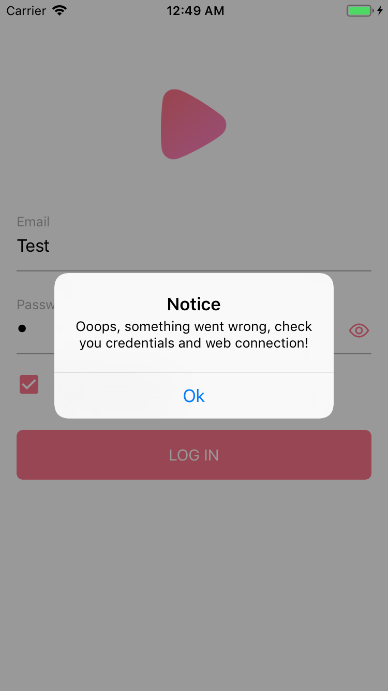 

## ShowView

If loged correctly, the ShowView will be shown which contains of a list followd shows. on the top right is a button which allows you to logOut. 

 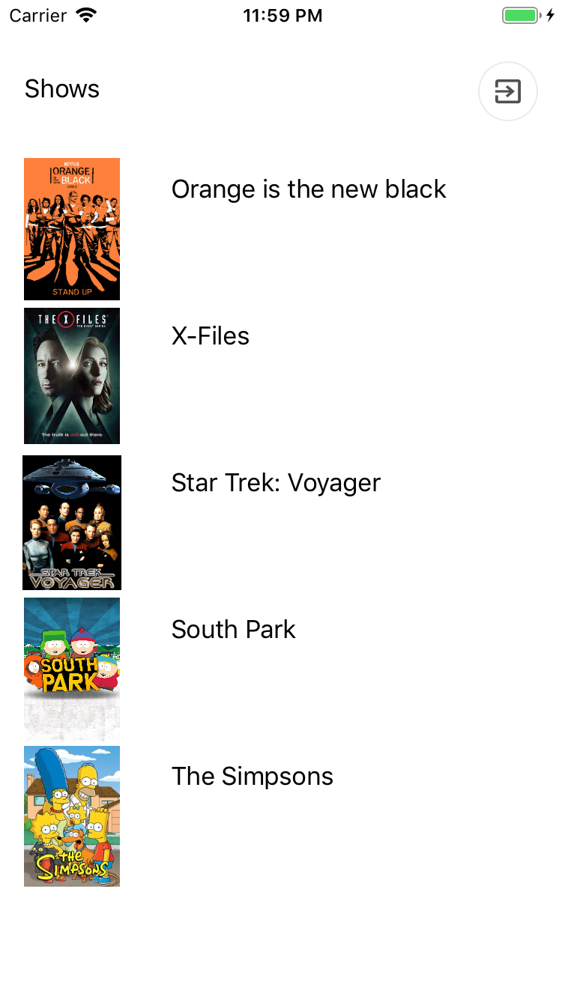 
 
 ## ShowDetailsView
 
 This screen is showing show description, its episodes and button for adding new episodes. Whole view is inside scrollView.
 
 
 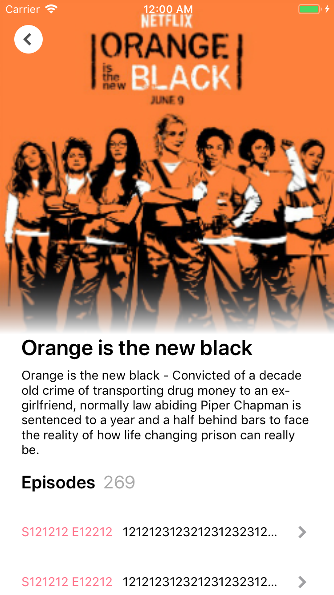  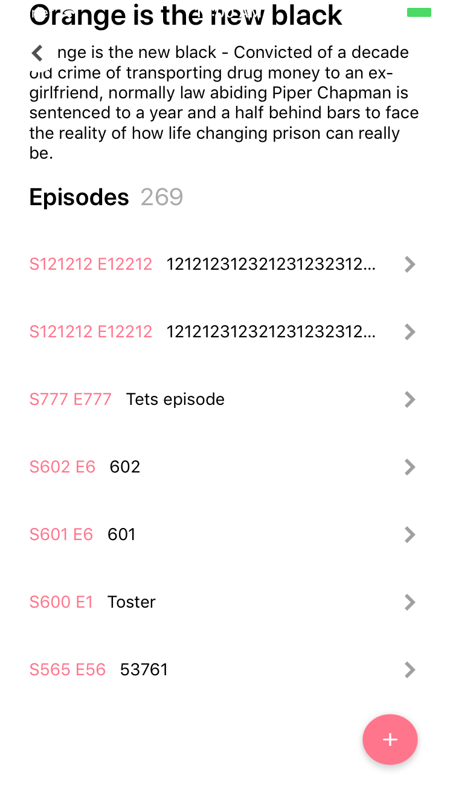 
 
 ## AddEpisodeView
 
 You can create episode for  specific show. For creating it's needed to fill the requed fields and upload image. For image upload you can pick between taking picture with camera or opening photo library.
 
 
 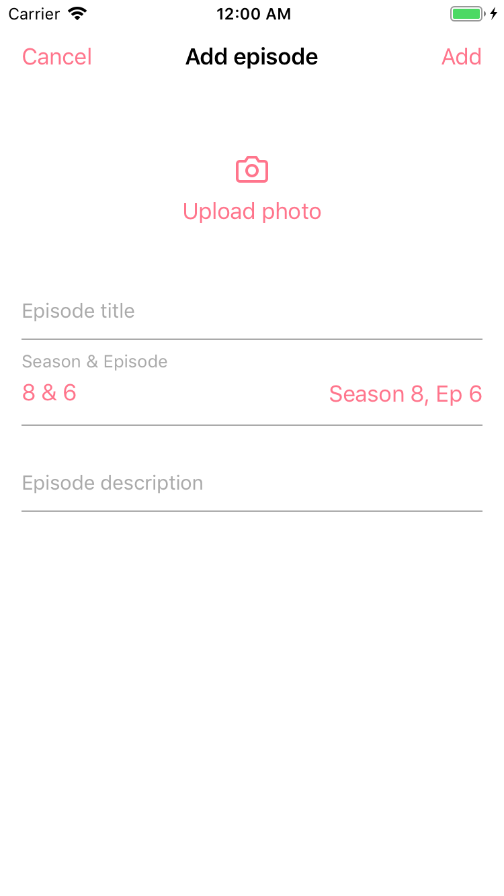  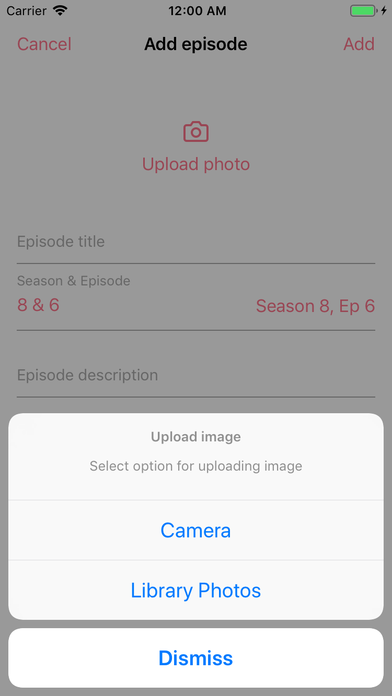 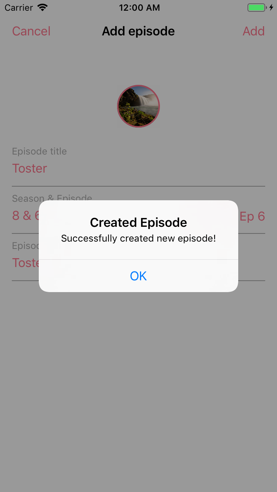 
 
 ## EpisodeDetailsView
 
 While clicking on specific show episode, you get navigated to view with more description of episode. Here you can press button for showing comments inside that epsode.
 
  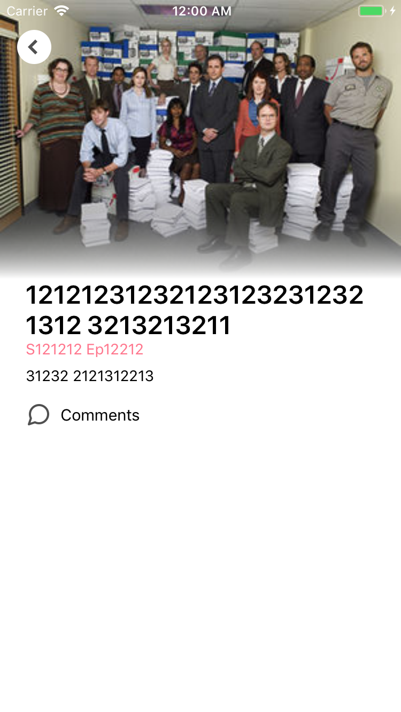 
  
  ## EpisodeCommentsView
  
  Comments view for commenting with users in specific episode.
  
   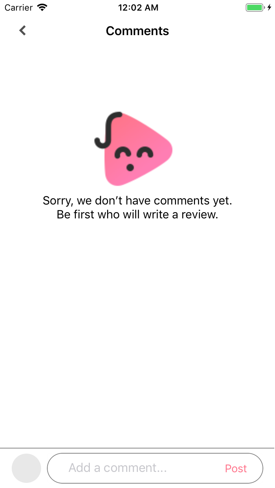 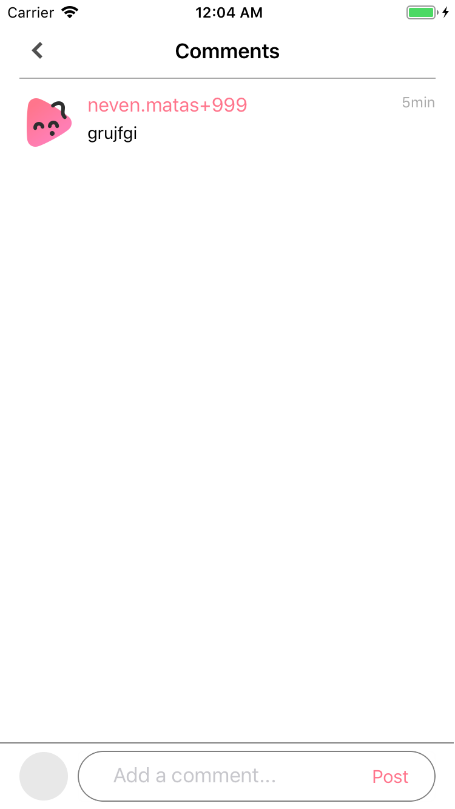 
  
 
